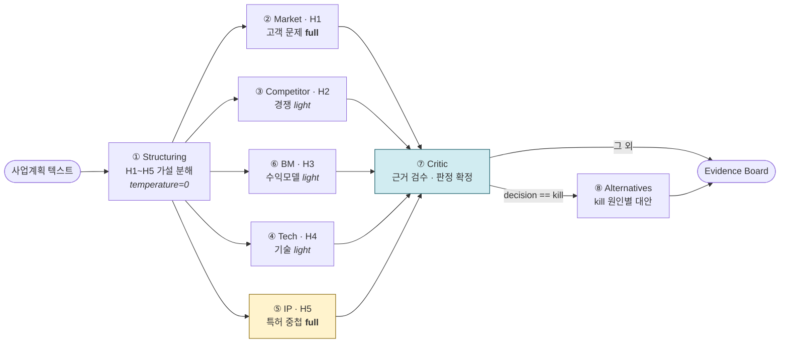

# VentureScout

> 창업 아이디어를 5개 가설로 분해하고, **실제 특허·리뷰·가격 데이터에서 찾은 근거로만**
> Go / Pivot / Kill / More Research를 판정하는 Evidence 기반 멀티 에이전트.


> 4인 팀 프로젝트입니다. 원본: `de-ai-AIAgentPJ-team4/venturescout` · 담당 범위는 [6. 내 역할](#6-내-역할)

---

## 1. 아키텍처



**판정은 코드가, 서술은 LLM이.** `_decide()`가 scorecard(근거 강도·반박 수·IP 리스크)로
decision을 **LLM 호출 이전에** 확정합니다. 같은 근거 → 항상 같은 판정.

**목적이 다른 두 인덱스**

| 인덱스 | 검색 단위 | 소비 노드 |
|---|---|---|
| `documents.embedding` | 시드 리뷰 / 경쟁사 / 가격, 특허 초록 | ② ③ ⑥ |
| `claim_limitations.embedding` | 특허 청구항을 **구성요소 단위로 분해** | ⑤ (시그니처) |

`hybrid_score = 0.6 × cosine + 0.4 × ts_rank`, HNSW + GIN 2단계 후보생성.

> ⚠️ **명목 가중치가 실제 가중치가 아니었습니다.** 두 항의 스케일이 다릅니다 —
> 상위 20건에서 `1-cosine`의 폭은 0.17인데 `ts_rank`는 0.73~0.84입니다. 순위를
> 가르는 건 절대값이 아니라 폭이라, 0.4를 곱한 키워드가 실제로는 순위 변별의
> **74~77%**를 차지했습니다(`seed_review`만 33%). 전역 상수 하나가 코퍼스마다
> 다르게 동작한 셈입니다. 후보군 안에서 각 항을 0~1로 펴는 **min-max 정규화**로
> 바꿨고(`FUSION_MODE`로 RRF·기존 방식 전환 가능), 그제서야 가중치 스윕이 곡선을
> 그립니다 ([ADR-049](AIAgentPJ_ADR_v7.md)).
>
> rerank 4축 중 `stance`는 오랫동안 **계산하는 코드가 없어** contradiction 축이
> 죽어 있었습니다. NLI 모델은 정확도 33%로 기각했고([ADR-046](AIAgentPJ_ADR_v7.md)),
> 적재 시점 LLM 배치 태깅으로 F1 0.912를 확인해 채택했습니다
> ([ADR-047](AIAgentPJ_ADR_v7.md)). 단 축마다 변별력이 달라 특허 축
> (`technology`/`ip`)은 판정이 한쪽으로 쏠려 기각했습니다
> ([ADR-048](AIAgentPJ_ADR_v7.md)). reliability·freshness는 여전히 source_type별
> 하드코딩이라 단일 스코프 쿼리 안에서 상수입니다.

---

## 2. 문제 (Problem)

**근거 없는 판정을 구조적으로 차단** — 모든 주장을 `evidence_id`에 묶고
(`grounded_on: Field(..., min_length=1)`), Critic이 존재하지 않는 ID 인용을 검사합니다.

**같은 입력 → 같은 판정** — LLM에 판정권을 주면 문장 변동만으로 GO↔KILL이 뒤집힙니다.
판정을 6개 규칙의 결정 트리로 코드에 고정하고 단위 테스트로 검증했습니다.

**특허를 "무엇이 겹치는지" 나오는 단위로 검색** — 청구항 전문을 통째로 임베딩하면
유사도는 나와도 어느 구성요소가 겹치는지를 못 짚습니다. claim → limitation으로 분해했습니다.

---

## 3. 규모 & 성과

| 항목 | 수치 |
|---|---|
| 에이전트 그래프 | 8노드 (구조화 → 병렬 5 → Critic → 조건부 대안) |
| 코퍼스 | 특허 220건 / 청구항 4,075 / claim limitation 8,122 + 시드 270건 |
| 임베딩 | PatentSBERTa 768d, 8,342건 전량 (동기화율 1.0) |
| 실행당 비용 | 최적화 전 **$0.400 – $0.434** (7–8 콜). 최적화 후는 **미측정** |
| 검색 품질 개선 | relevance_score **0.16–0.21 → 0.46–0.73** |
| 판정 캘리브레이션 | 3개 도메인 입력이 **KILL / PIVOT / PIVOT**으로 분리 (이전: 전부 KILL) |
| Critic 컨텍스트 최적화 | **45,570 → 18,191자 (−60.1%)**, 토큰 기준은 미검증 |
| **검색 품질 (실측)** | **P@5 0.400 / Recall@5 0.620 / MRR 0.512 / NDCG 0.548** (라벨 70건, 쿼리 7개) — 아래 단서 참조 |
| **검색 지연 (실측)** | **p50 95ms / p95 148ms / p99 236ms** — 이 중 임베딩이 63%(p50 60ms) |
| 실행 상한 | 잡당 비용·LLM 호출·graph step 상한으로 폭주 차단 |
| 테스트 | `pytest tests/` **120 passed** |

> **데이터 범위** — 특허는 HUPD(Harvard USPTO Patent Dataset) 2016년 1월 출원분에서
> CPC `G06Q30`(전자상거래)으로 추린 220건입니다. 원래는 BigQuery Google Patents
> 2021–2024 등록특허였으나, 부트캠프 종료로 공용 인프라(RDS·S3·GCP)가 정리되면서
> 가입 없이 받을 수 있는 공개 데이터셋으로 출처를 바꿨습니다.
>
> **위 P@5 0.400을 그대로 읽으면 안 됩니다.** 라벨셋의 쿼리당 정답이 1~2건이라
> **P@5의 이론적 천장이 0.457**이었습니다(7개 쿼리 중 4개가 이미 만점, 1개는 정답이
> 0건이라 무엇을 검색해도 0점). 검색이 아니라 **측정이 개선을 담지 못하는 상태**였고,
> rerank 가중치 14조합이 전부 같은 점수를 낸 것도 같은 이유였습니다.
> 후보 생성을 벡터/키워드/하이브리드 세 설정의 합집합(TREC식 pooling)으로 바꾸고
> 쿼리를 7 → 25개로 늘려 천장을 0.96까지 올렸습니다 — 하이브리드 단독 후보 풀은
> 실제의 절반 수준이었습니다([ADR-048](AIAgentPJ_ADR_v7.md)).
> **확정 수치는 사람 라벨 확인 후 갱신합니다.** LLM 초벌만으로 낸 잠정치는
> 자기참조 위험이 있어 싣지 않았습니다.
>
> **아직 측정하지 않은 것** — Answer/Citation Accuracy, Task Success Rate,
> 최적화 후 실행당 비용. 측정되지 않은 지표는 싣지 않았습니다.

---

## 4. 설계 판단 (Trade-off)

| 선택 | 포기 | 이유 |
|---|---|---|
| **판정을 코드 규칙으로 확정**, LLM은 서술만 | LLM의 종합 판단력 | 재현성·테스트 가능성. 임계값 변경 근거가 코드에 남습니다 |
| **rerank에 contradiction 축 추가** | 순수 relevance 정렬 | 오랫동안 `stance` 산출이 없어 죽어 있던 축입니다. NLI는 정확도 33%로 기각(ADR-046), 적재 시점 LLM 배치 태깅으로 F1 0.912를 확인해 채택(ADR-047). 검색 지연은 0입니다 — 판정을 미리 계산해 `documents.meta`에 넣어 두기 때문입니다 |
| **2단계 후보생성** (인덱스 → 합성식) | SQL 단순함 | 합성식을 전체 테이블 `ORDER BY`에 걸면 인덱스를 못 타 풀스캔 |
| **프롬프트 캐싱 기각** | 입력 토큰 절감 | Sonnet 4.6 최소 캐시 prefix 1024토큰 vs 공유 prefix ~150토큰. 게다가 분석 5노드가 **병렬**이라 동시 요청이 서로의 캐시를 못 읽습니다 |

---

## 5. 트러블슈팅

### 5-1. 입력과 무관하게 항상 KILL이 나오던 문제

| | |
|---|---|
| **증상** | 실 RDS + Bedrock E2E 3건이 아이디어 내용과 무관하게 전부 KILL |
| **관측** | `market` / `competitor` / `bm`이 **구조적으로 항상 low confidence** |
| **원인** | `strength = mean(relevance × reliability)`인데 시드 출처 `reliability = 0.6` 고정 → **시드 strength 상한이 0.47**. 임계값 mid=0.45를 거의 못 넘겨 `_decide` 규칙3(low ≥ 3)에 걸림. **GO/PIVOT이 도달 불가능한 상태였습니다** |
| **조치** | 3개 도메인의 실측 strength 분포를 뽑아 경계를 다시 그음. on-domain 0.42–0.45 / off-domain 0.16–0.33이 분리되는 지점인 **mid 0.45 → 0.40**, 특허 근거(reliability 0.9)가 도달 가능한 **high 0.75 → 0.60** |
| **결과** | 축산 IoT → KILL, 임베디드 결제 → PIVOT, SaaS → PIVOT. 네 판정이 모두 도달 가능해짐 |

### 5-2. 한국어 쿼리로 영문 특허를 검색하던 문제

| | |
|---|---|
| **증상** | 검색은 되는데 `relevance_score`가 0.16–0.21에 고착 |
| **관측** | 임베딩 모델 PatentSBERTa는 **영문 전용**인데 가설 문장이 한국어였음 |
| **원인** | 쿼리와 코퍼스의 언어 불일치. 검색 알고리즘이 아니라 **쿼리 생성 단계**의 문제 |
| **조치** | Structuring이 `hypotheses[].statement`·`patent_keywords`를 **영어로 생성**하도록 변경. 사람이 읽는 `technical_elements`만 한국어 유지. 쿼리 결정성을 위해 `temperature=0` 적용 |
| **결과** | `relevance_score` **0.46–0.73**으로 회복 |

---

## 6. 내 역할

**Track C — ⑧ Alternatives 에이전트 end-to-end 설계·구현** (4인 팀)

| 구분 | 담당 |
|---|---|
| 설계·계약 | 대안 제안 에이전트 설계 문서, `AgentName` 확장, `critic_scorecard` State 필드 |
| 로직 | `_kill_reason` (IP 충돌 / 근거 약함 판별), `_alternatives_evidence_ids` (원인별 인용 가능 근거를 **코드가 먼저 선별** — LLM의 임의 인용 차단) |
| 배선 | `_route_after_critic` 조건부 라우팅, LLM 실패 시 graceful skip으로 kill 리포트 보존 |
| 표면·최적화 | API `STAGE_LABELS`, Evidence Board 대안 섹션, Critic 컨텍스트 −60.1% |

| 트랙 | 범위 | 에이전트 |
|---|---|---|
| A | 데이터 수집·적재 (BigQuery → S3 → RDS) | — |
| B | 검색·임베딩 파이프라인 | ② ③ |
| **C (본인)** | 에이전트 플랫폼 · 척추 · 계약 | ① ④ ⑤ ⑦ **⑧** |
| D | 백엔드 · UI · 평가 하네스 | ⑥ |

---

## 7. 실행 방법

**AWS 없이 검색 계층만** (로컬, 비용 0)

Docker가 필요한 건 **`db` 하나뿐**입니다. pgvector는 Postgres 확장이라 Windows
설치형에는 기본 포함이 아니고, 문서·청구항·임베딩이 그 컨테이너 볼륨에 들어 있습니다
(환경 맞추기가 아니라 데이터 저장소입니다). 나머지 스크립트는 `pip install -r
requirements.txt` 후 호스트에서 직접 돌리는 편이 빠릅니다 — 컨테이너 기동 오버헤드가 없습니다.

```bash
docker compose up -d db                     # postgres + pgvector, init.sql 자동 적용
docker compose run --rm -e DATABASE_URL=postgresql://vs:vs_local@db:5432/venturescout   api python -m data.load_seed              # 시드 270건
docker compose run --rm -e DATABASE_URL=... api python -m pipeline.indexer --batch-size 32
pytest tests/                               # 120 passed
```

특허 코퍼스까지 채우려면 `python -m data.collect_from_hupd --cpc G06Q30`.
전체 절차와 트러블슈팅은 **[docs/local-setup.md](docs/local-setup.md)**.

**회귀 확인** — 테스트와 검색 지표를 한 번에 재고 기준선과 diff를 찍습니다.
LLM을 쓰지 않아 반복 실행 비용이 0입니다.

```bash
python -m eval.regression            # 기준선 대비 변화
python -m eval.regression --save     # 현재를 기준선으로
```

`fusion_mode`·가중치·임베딩 모델도 함께 기록되므로, 지표 변화가 **코드 때문인지
설정 때문인지** 구분됩니다.

**에이전트 전체 실행**에는 Bedrock 자격증명이 추가로 필요합니다(`.env`).
컨테이너 Python 3.11 표준, 스키마는 `db/init.sql`.

---

## 8. 회고

**결정을 근거와 함께 남긴 것이 가장 큰 자산이었습니다.** ADR을 v1부터 v7까지 쌓으면서
"왜 이 값인가"와 **"무엇을 기각했는가"** 를 같이 적었습니다. 프롬프트 캐싱을 기각할 때도
근거를 남겼는데(최소 캐시 prefix 1024토큰 미달 + 분석 5노드 병렬이라 캐시 공유 불가),
이게 없으면 다음 사람이 같은 걸 또 시도합니다.

**인프라가 사라진 뒤에도 재현 가능하게 만든 것.** 부트캠프 종료로 RDS·S3·Bedrock이
모두 끊겼지만, 시드는 레포에 남아 있었고 특허는 공개 데이터셋으로 대체할 수 있었습니다.
로컬 docker만으로 검색 계층 전체를 복구했고, 그 과정에서 원래 있던 버그 4건
(`indexer` 진입점 부재, 라벨셋 기본값 바인딩으로 테스트가 잘못된 이유로 통과,
포트 충돌, OOM 배치 크기)이 드러났습니다. **환경을 다시 세워봐야 보이는 것들이었습니다.**

**병목은 재봐야 압니다.** 검색 지연을 embed/SQL로 나눠 재보니 **임베딩이 63%**였습니다.
DB 쿼리를 최적화하려던 계획이 틀렸다는 뜻이고, 동시에 특허 8,122건을 뒤지는 쿼리가
시드 270건 쿼리와 지연이 같다는 것도 확인됐습니다 — HNSW 인덱스가 실제로 듣고 있다는 근거입니다.

**"검색이 이상하다"가 검색 문제가 아닐 수 있다는 걸 배웠습니다.** relevance가 안 나올 때
rerank 가중치부터 만졌지만 실제 원인은 쿼리 생성 단계의 언어 불일치였습니다. 비용도
오래 수기 추정으로 답하다가 실측을 붙이고서야 2배 차이를 알았습니다. **파이프라인은
증상이 나타난 곳과 원인이 있는 곳이 다르고, 계측 없이는 최적화 우선순위도 틀린다**는 것.
